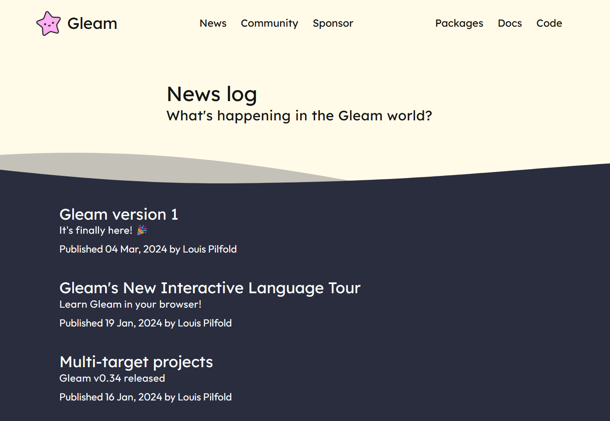
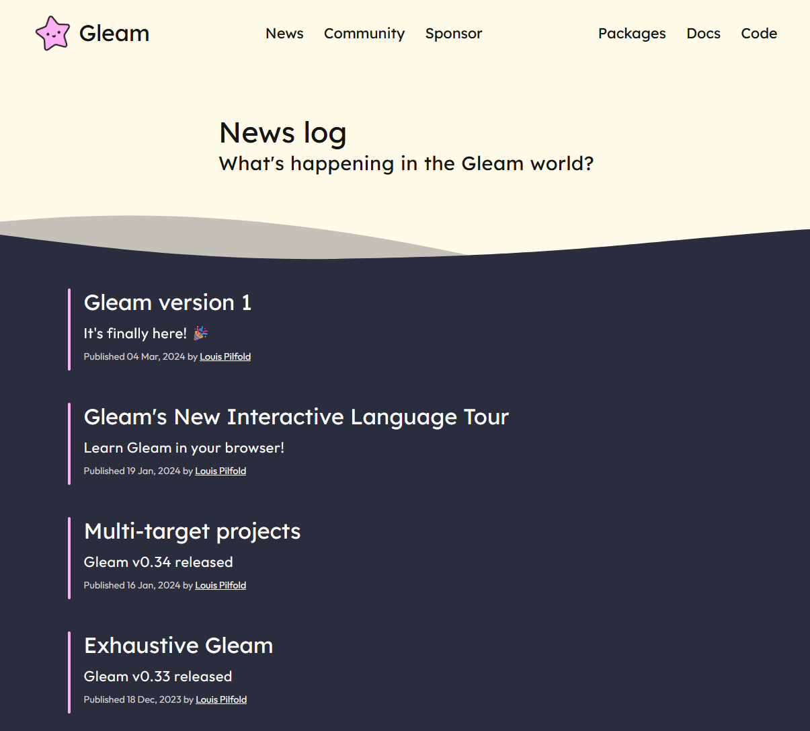

# Gleam Website Contributions
By Dawson

## Intro
Heyo! Firstly, I wanted to mention that I was introduced to gleam by a youtuber name [Theo - t3.gg](https://www.youtube.com/watch?v=_I-CSgoCgsk) => [Video](https://www.youtube.com/watch?v=_I-CSgoCgsk)

I'm not overly confident in my programming abilities, nor my ability to contribute in a meaningful way towards projects, but I was very hopeful after I started reading the Issues found in the [Gleam Repo](https://github.com/gleam-lang/gleam). The creator of the project [Louis Pilford @Ipil](https://github.com/lpil) is an incredibly kind and passiant individual who answers promptly in every issue I've looked at. I've been diligant in reading new issues and issues labled "good first issue" but I was never able to think of an appropriate solution for their problem. Until recently, I was only aware of their main repo, but later came across their [website repo](https://github.com/gleam-lang/website).

## Issue
There were a few things that I noticed within "issues", mainly [issue #354](https://github.com/gleam-lang/website/issues/354) where their main sponsor logo was difficult to read on its dark background.

### Before

### After

I went through each post file and just changed the img src file to `./images/sponsors/fly-inverted.svg` from `./images/sponsors/fly.svg`

Afterwards, I was looking at the [News page](https://gleam.run/news/) and felt like it was very bland, awkwardly spaced and a little hard on the eyes. One of the things that I am good at is CSS, and I thought it may be a little nice to add some separation, and design elements.

### Before

### After

I added a `::before` to the `<li>` and set it to `var(---color-faff-pink)` which is one of the main highlight colors. I reduced the `` published text size to `var(--font-size-small)` and its color to `var(--color-code-grey)`. I wanted to keep consistent styling, which is why I used the `:root` variables that we're initially created. 

Inside the `news.html` file I added an `<a>` tag to the `{{ post.author}}` and then gave it the `.links` and `.author` class and set its `target="_blank"` with an `href="{{post.author-link}}"`. Assigning a link to the author isn't very useful right now, as there is only a single author, but I was attempting to future proof it, as well as style it. I also gave the `<h2>` which is the `{post.title}` the `.links` class. Lastly, I gave the `.links {transition:color 200ms ease-in-out} .links:hover{ color: var(--color-faff-pink)}` and the `.author {text-decoration: underlined}`.

To fix the spacing issue I had within the `<li>` tag I assigned did `li {display: flex; flex-direction: column; justify-content: space-between;}` to have all of the content spaced evenly within the `<li>`

Although this change wasn't asked for, or neccesarily needed, I believe it adds a layer of interest to the news page, and also helps to bring attention to the clickable elements. It also breaks up the incredibly white, drawing your eyes to the more important elements, and making the posts slightly more digestible.

Lastly, within the `<li>` I added some custome data attributes `post-tags` and `post-author` with the idea that potentially later on there will be posts with differing tags, and authors. the code looks like `post-tags="{{tag}} "` and `{{post.author}}`

The only thing I would also do is add pagination to the posts, however, I am not very familiar with the jekyll, and don't believe it quite neccesary at this time.

The final thing I did was apply a hover effect to the footer logo, so it has the same effect as the one in the hero section. Reasons? I thought the effect was really nice, and I wanted to give some more visual interest somewhere else on the page.

## Conclusion
Although the contribution I made are small, and most probably unimportant, I think they help add a little bit of character to the news, as well as some much needed indications of what is the link